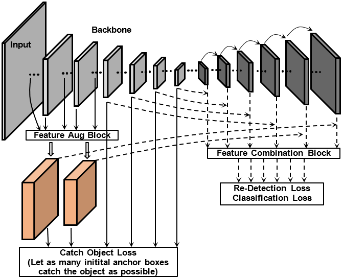

# road_object_detection
CNN based model of object detection for BDD100K, the source code support many configuration.

## Approaches
We used mobilenet_v2 as backbone, but change its stride(==2) of first convolution layer into stride==1. The whole net is similar to  [RefineDet](https://arxiv.org/abs/1711.06897), but we don't classify the background and object in refinement module, we just want the anchors to catch as many as objects in refinement module, and then use the up-sample to build the object detection module.

